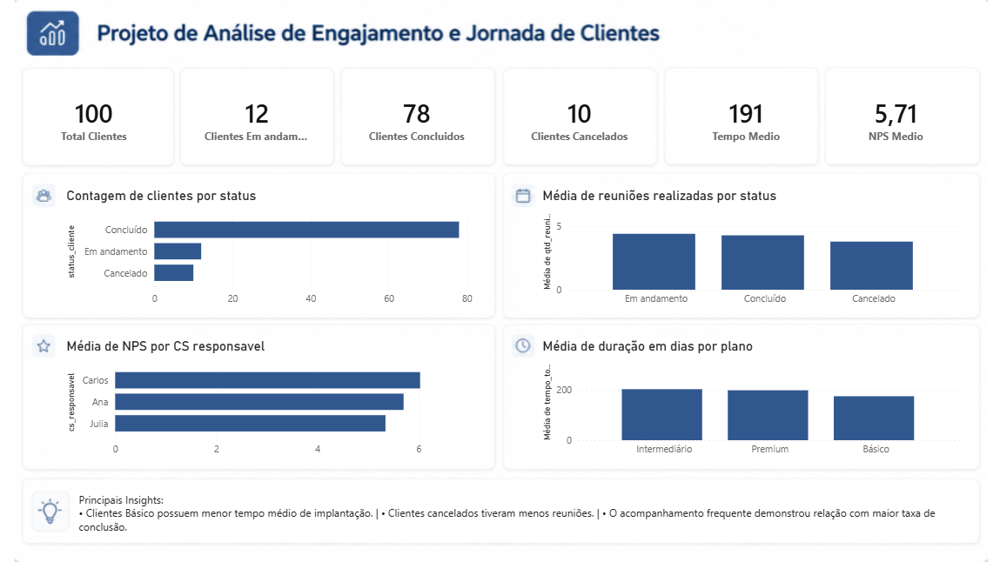

# Análise de Jornada e Engajamento de Clientes

## Objetivo

Este projeto tem como objetivo analisar a jornada de implantação de clientes, identificando gargalos operacionais, padrões de cancelamento e fatores relacionados ao sucesso da implantação.

---

## Ferramentas Utilizadas

* Python
* Pandas
* Google Colab
* Power BI
* GitHub

---

## Análises Realizadas

* Tempo médio de implantação
* Quantidade de clientes por status
* NPS médio por analista
* Relação entre reuniões e sucesso do cliente
* Comparação entre planos

---

## Principais Insights

* Clientes concluídos apresentaram maior média de reuniões.
* Clientes Premium tiveram menor tempo médio de implantação.
* Clientes cancelados apresentaram menor engajamento durante a jornada.

---

## Dashboard



---

## Estrutura do Projeto

```plaintext
projeto-engajamento-clientes/
│
├── README.md
│
├── dados/
│   └── base_clientes.csv
│
├── notebooks/
│   └── analise_clientes.ipynb
│
├── dashboard/
│   └── dashboard_clientes.pbix
│
└── imagens/
    └── dashboard.png
```
